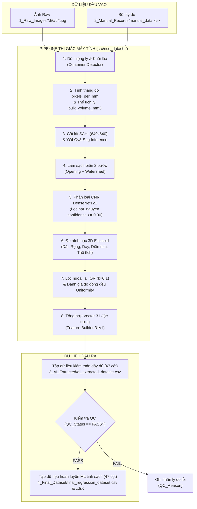

# 🌾 DATASET_BUILDER — Module Trích Xuất & Xây Dựng Tập Dữ Liệu

Tài liệu giới thiệu kiến trúc, quy chuẩn dữ liệu và hướng dẫn toàn diện cách vận hành quy trình trích xuất dữ liệu hình học 3D hạt lúa (31 đặc trưng) từ ảnh chụp thực nghiệm và sổ tay đo đạc.

---

## 1. Giới Thiệu Tổng Quan (Overview)

`DATASET_BUILDER` là gói công cụ độc lập (standalone package) chịu trách nhiệm xây dựng tập dữ liệu huấn luyện Machine Learning cho toàn bộ đề tài nghiên cứu. 

Module thực hiện tự động hóa toàn bộ chuỗi xử lý thị giác máy tính:
1. **Tiếp nhận dữ liệu thô:** Đọc đồng thời ảnh raw độ phân giải cao (4K/8K) từ thư mục `1_Raw_Images/` và thông số đo thực nghiệm từ file Excel `2_Manual_Records/manual_data.xlsx`.
2. **Định vị & Chuẩn hóa Thang đo vật lý:** Tự động phát hiện miệng ly chứa lúa, xác định vùng mặt lúa và tính toán tỉ lệ pixel thực tế (`pixels_per_mm`).
3. **Phân đoạn hạt siêu phân giải (SAHI + YOLOv8-Seg):** Cắt lát ảnh thông minh thành các ô 640×640 với độ chồng lấp 25%, phát hiện mặt nạ từng hạt lúa và ghép lại bản đồ toàn cảnh.
4. **Làm sạch mặt nạ & Phân loại chất lượng:** Loại bỏ nhiễu biên (Morphological Opening + Watershed) và đưa qua mạng nơ-ron **CNN DenseNet121** để phân loại hạt nguyên vẹn (`hat_nguyen`) với độ tin cậy $\ge 90\%$.
5. **Trắc lượng hình học 3D (3D Ellipsoid Geometry):** Đo đạc chiều dài ($2a$), chiều rộng ($2b$), ước lượng độ dày ($2c = 0.8 \times 2b$) và tính thể tích elipsoid từng hạt.
6. **Lọc ngoại lai & Đánh giá độ đồng đều:** Sử dụng bộ lọc IQR ($k=0.1$) loại bỏ hạt dị tật, tính tỉ lệ đồng đều bề mặt.
7. **Đóng gói dữ liệu chuẩn tắc (31 Đặc trưng):** Xuất tập dữ liệu kiểm toán đầy đủ (`3_AI_Extracted/ai_extracted_dataset.csv`) và tập dữ liệu tinh sạch đã vượt qua kiểm định chất lượng QC (`4_Final_Dataset/final_regression_dataset.csv`, `.xlsx`).



---

## 2. Cấu Trúc Thư Mục (Directory Layout)

```text
DATASET_BUILDER/
├── AI_DATASET_EXTRACTION_PIPELINE.ipynb   # 🚀 Notebook điều phối trích xuất chính (Colab GPU / Local)
├── README.md                              # 📖 Tài liệu hướng dẫn này
├── analyze_dataset.py                     # 📊 Công cụ phân tích thống kê & tương quan 31 đặc trưng
├── check_filtered_grains.py               # 🔍 Công cụ kiểm toán chi tiết số hạt bóc tách
├── DATASET_EDA_AND_FEATURE_SELECTION.ipynb # 📈 Notebook phân tích khám phá dữ liệu & lựa chọn đặc trưng
├── config/
│   └── extraction_config.json             # ⚙️ Tệp cấu hình tham số thị giác & đường dẫn tập trung
├── src/
│   └── rice_dataset/                      # 📦 Gói mã nguồn Python chuẩn tắc
│       ├── __init__.py
│       ├── config.py                      # Trình nạp & xác thực cấu hình
│       ├── contracts.py                   # Định nghĩa hợp đồng 31 đặc trưng, cột dữ liệu & trạng thái QC
│       ├── feature_builder.py             # Logic tính toán 31 đặc trưng & chẩn đoán vật lý
│       ├── pipeline.py                    # Trình điều phối trích xuất hàng loạt (Batch Pipeline)
│       ├── io/
│       │   ├── manual_records.py          # Đọc & kiểm tra tính hợp lệ file manual_data.xlsx
│       │   ├── image_index.py             # Lập chỉ mục & kiểm kê đối chiếu 1-1 ảnh raw
│       │   └── dataset_writer.py          # Xuất dữ liệu nguyên tử ra file CSV/XLSX
│       └── vision/                        # Các module thị giác máy tính chuyên sâu
│           ├── container_detector.py      # Dò miệng ly elip & bề mặt lúa
│           ├── grain_segmenter.py         # Phân đoạn hạt bằng SAHI + YOLOv8-Seg
│           ├── grain_crop_cleaner.py      # Làm sạch mặt nạ hạt 2 bước
│           ├── grain_classifier.py        # Phân loại hạt nguyên bằng CNN DenseNet121
│           ├── ellipsoid_geometry.py      # Tính toán thể tích & kích thước hình học 3D
│           ├── grain_size_filter.py       # Bộ lọc IQR loại bỏ hạt ngoại lai
│           └── uniformity_evaluator.py    # Đánh giá tỉ lệ đồng đều bề mặt
├── 1_Raw_Images/                          # 📷 Thư mục chứa toàn bộ ảnh gốc phẳng (M0001.jpg -> M####.jpg)
├── 2_Manual_Records/                      # 📝 Sổ tay đo đạc thực nghiệm (manual_data.xlsx, capture_data.sqlite3)
├── 3_AI_Extracted/                        # 🗄️ Tập dữ liệu kiểm toán trích xuất thô (ai_extracted_dataset.csv)
├── 4_Final_Dataset/                       # 🎯 Tập dữ liệu huấn luyện hồi quy hoàn chỉnh (final_regression_dataset.csv, .xlsx)
└── CAPTURE_APP/                           # 📱 Ứng dụng Desktop + Mobile Client thu thập dữ liệu tự động
```

---

## 3. Quy Chuẩn Dữ Liệu Đầu Vào (Input Contracts)

Để quy trình trích xuất vận hành chính xác và tự động, dữ liệu đầu vào phải tuân thủ nghiêm ngặt **Quy ước Định danh Phẳng (Flat Inventory Contract)**:

1. **Mã định danh mẫu (`Sample_ID`):**
   - Viết hoa, có tiền tố `M` và đúng 4 chữ số: `M0001`, `M0002`, ..., `M0382`.
   - Tuyệt đối không sử dụng thư mục con phân cấp cũ (`M001/M001A.jpg`).
2. **File ảnh gốc (`1_Raw_Images/`):**
   - Tên file ảnh phải trùng khớp 100% với `Sample_ID`: ví dụ `M0001.jpg`.
   - Định dạng ảnh hỗ trợ: `.jpg`, `.jpeg`, `.png`.
3. **File sổ tay thực nghiệm (`2_Manual_Records/manual_data.xlsx`):**
   - Mỗi hàng tương ứng với đúng một mẫu ảnh.
   - Bắt buộc phải có các cột: `Sample_ID`, `Weight_g`, `Container_Height_mm`, `Inner_Diameter_mm`, `Empty_Height_mm`, `Rice_Height_mm`, `Actual_Count`.
   - **Tỉ lệ đối ứng 1:1:** Mỗi mã mẫu trong Excel bắt buộc phải có đúng một file ảnh trong thư mục `1_Raw_Images/`.

---

## 4. Hướng Dẫn Chạy Trích Xuất Dữ Liệu (Execution Guide)

### Cách 1: Chạy trên Google Colab GPU (Khuyên Dùng)

Do việc cắt lát SAHI và chạy mô hình phân đoạn trên ảnh 4K/8K tiêu tốn nhiều năng lượng tính toán, việc chạy trên **Google Colab với GPU (T4 hoặc A100)** mang lại tốc độ xử lý nhanh nhất và ổn định nhất.

#### Quy trình 6 bước thực hiện:

1. **Mở Notebook:**
   Mở file [`AI_DATASET_EXTRACTION_PIPELINE.ipynb`](AI_DATASET_EXTRACTION_PIPELINE.ipynb) bằng Google Colab.

2. **Kích hoạt GPU:**
   Vào menu **Runtime** $\to$ **Change runtime type** $\to$ Chọn Hardware accelerator: **GPU** (loại GPU: **T4**).

3. **Chạy Thiết lập Môi trường (Section 1 — 3):**
   - **Section 1:** Mount Google Drive và xác định đường dẫn thư mục dự án `PROJECT_ROOT`.
   - **Section 2 & 3:** Cài đặt các thư viện phụ thuộc tối thiểu:
     ```bash
     !pip install -q ultralytics sahi tensorflow openpyxl pandas numpy opencv-python
     ```
     Kiểm tra đầu ra xác nhận: `🎮 CUDA Available: True (Device: Tesla T4)`.

4. **Nạp Cấu Hình & Kiểm Tra Kiểm Kê (Section 4 — 7):**
   - **Section 4 & 5:** Tự động đọc file cấu hình [`config/extraction_config.json`](config/extraction_config.json) và kiểm tra tính tồn tại của mô hình YOLO (`weights/best.pt`), CNN (`best_v3_step2.keras`).
   - **Section 6 & 7:** Quét kiểm kê (Preflight Inventory). Hệ thống sẽ đối chiếu kiểm tra:
     ```text
     ✅ Input inventory: 382 workbook rows, 382 flat images, 382 unique Sample_ID values.
     ```

5. **Khởi Tạo Mô Hình & Chạy Trích Xuất (Section 8 — 10):**
   - **Section 8:** Tải mô hình YOLO và CNN DenseNet121 lên bộ nhớ GPU (chỉ tải duy nhất 1 lần).
   - **Section 9 & 10:** Bắt đầu chạy trích xuất hàng loạt:
     ```python
     # Đặt limit=None để xử lý toàn bộ, hoặc limit=5 để chạy thử nghiệm nhanh
     results = pipeline.run_batch(limit=None, export=True)
     ```
     Mỗi mẫu được xử lý sẽ hiển thị tiến trình, số lát SAHI, thời gian thực thi và trạng thái kiểm định chất lượng:
     ```text
     [001/382] M0001 -> PASS [22.86s]
     [002/382] M0002 -> PASS [9.01s]
     ...
     🏁 Batch extraction complete in 3818.9s.
        Total rows: 382 | PASS: 354 | Non-PASS: 28
     ```

6. **Kiểm Thử Hợp Đồng Xuất Bản (Section 11 — 12):**
   - Xác minh tự động các tệp đầu ra khớp đúng hợp đồng 47 cột:
     - `3_AI_Extracted/ai_extracted_dataset.csv` (Đủ 382 dòng kiểm toán).
     - `4_Final_Dataset/final_regression_dataset.csv` (354 dòng đạt PASS).
     - `4_Final_Dataset/final_regression_dataset.xlsx` (354 dòng đạt PASS).

---

### Cách 2: Chạy Trên Máy Cục Bộ (Local Machine)

Nếu máy tính của bạn có card đồ họa rời NVIDIA (hỗ trợ CUDA) hoặc bạn muốn chạy thử nghiệm trên CPU:

#### Bước 1: Kích hoạt môi trường Python
Sử dụng môi trường ảo đã cài đặt sẵn thư viện:
```powershell
# Kích hoạt venv (từ thư mục gốc repo)
.\AI_SERVICES\.venv\Scripts\Activate.ps1
```

#### Bước 2: Chạy qua Python Script thuần
Bạn có thể viết một đoạn script ngắn (hoặc chạy trong terminal Python):

```python
from pathlib import Path
from rice_dataset.config import ExtractionConfig
from rice_dataset.pipeline import DatasetExtractionPipeline

# 1. Nạp cấu hình
config_path = Path("DATASET_BUILDER/config/extraction_config.json")
config = ExtractionConfig.from_file(config_path)

# 2. Khởi tạo pipeline
pipeline = DatasetExtractionPipeline(config)
pipeline.initialize_models()

# 3. Chạy trích xuất hàng loạt (ví dụ chạy thử 3 mẫu đầu tiên)
results = pipeline.run_batch(limit=3, export=True)
print("Hoàn thành trích xuất!")
```

---

## 5. Tham Số Cấu Hình Khoa Học (`config/extraction_config.json`)

Toàn bộ các ngưỡng kỹ thuật và tham số toán học được quản lý tập trung trong file [`config/extraction_config.json`](config/extraction_config.json):

| Tham số | Giá trị | Ý nghĩa khoa học |
| :--- | :---: | :--- |
| `yolo_model_load_confidence` | `0.70` | Ngưỡng tin cậy khi nạp mô hình YOLO-Seg |
| `yolo_result_confidence` | `0.50` | Ngưỡng lọc phát hiện đối tượng hạt lúa |
| `sahi_slice_size` | `640` | Kích thước ô cắt lát SAHI ($640 \times 640$ px) |
| `sahi_overlap_ratio` | `0.25` | Tỉ lệ chồng lấp giữa 2 ô cắt liền kề (25%) |
| `sahi_min_area_px` | `50` | Diện tích tối thiểu của hạt để giữ lại mặt nạ (tránh hạt vụn) |
| `clean_step1` | `k=5, neck=0.15, area=35` | Bước 1: Làm sạch thô & tách dính ban đầu |
| `clean_step2` | `k=3, neck=0.15, area=25` | Bước 2: Làm sạch tinh & làm đầy lỗ hổng mặt nạ |
| `cnn_whole_confidence` | `0.90` | Ngưỡng tin cậy của DenseNet121 để xác nhận `hat_nguyen` |
| `whole_grain_thickness_ratio` | `0.80` | Tỉ lệ độ dày hạt lúa $2c = 0.80 \times 2b$ (hiệu chuẩn bằng thước kẹp cơ học) |
| `physical_packing_fraction` | `0.55` | Hệ số lấp đầy trong ước lượng hình học vật lý thuần túy |
| `trained_hybrid_packing_fraction`| `0.62` | Hệ số lấp đầy tính toán cho **Đặc trưng 11** (`Estimated_Total_Seeds_Hybrid`) |
| `size_filter_k` | `0.1` | Hệ số hàng rào IQR lọc kích thước hạt ngoại lai |
| `uniformity_threshold` | `0.80` | Ngưỡng đánh giá độ đồng đều bề mặt |

---

## 6. Hợp Đồng 31 Đặc Trưng Hồi Quy (Feature Contract 31v1)

Tập dữ liệu đầu ra phục vụ huấn luyện Machine Learning chứa đúng **31 đặc trưng đầu vào** được nhóm thành 7 nhóm hình học và vật lý:

1. **Nhóm Vật Chứa & Thể Tích Khối Lúa (8 đặc trưng):**
   - `Bulk_Rice_Volume_mm3`: Thể tích khối lúa trong cốc ($mm^3$).
   - `Rice_Height_mm`: Chiều cao cột lúa trong cốc ($mm$).
   - `Weight_g`: Khối lượng tổng của khối lúa ($g$).
   - `Empty_Height_mm`: Chiều cao khoảng trống từ miệng cốc đến mặt lúa ($mm$).
   - `Pixels_Per_mm`: Thang đo tỉ lệ chuyển đổi từ pixel sang milimet ($px/mm$).
   - `Container_Detected_Diam_px`: Đường kính miệng cốc nhận diện được ($px$).
   - `Inner_Diameter_mm`: Đường kính trong thực tế của cốc ($mm$).
   - `Container_Height_mm`: Chiều cao thực tế của cốc ($mm$).
2. **Nhóm Bề Mặt & Ước Lượng (3 đặc trưng):**
   - `Whole_Grains_Count`: Số lượng hạt nguyên vẹn nhìn thấy trên bề mặt.
   - `Uniformity_Rate_Pct`: Tỉ lệ phần trăm độ đồng đều bề mặt (%).
   - `Estimated_Total_Seeds_Hybrid`: Số hạt ước tính sơ bộ theo công thức thể tích khối ($0.62 \times V_{bulk} / V_{grain}$).
3. **Nhóm Chiều Dài Hạt $2a$ (4 đặc trưng):**
   - `Grain_Length_mm_Mean`, `Grain_Length_mm_Min`, `Grain_Length_mm_Max`, `Grain_Length_mm_Std`.
4. **Nhóm Chiều Rộng Hạt $2b$ (4 đặc trưng):**
   - `Grain_Width_mm_Mean`, `Grain_Width_mm_Min`, `Grain_Width_mm_Max`, `Grain_Width_mm_Std`.
5. **Nhóm Độ Dày Hạt $2c$ (4 đặc trưng):**
   - `Grain_Thickness_mm_Mean`, `Grain_Thickness_mm_Min`, `Grain_Thickness_mm_Max`, `Grain_Thickness_mm_Std`.
6. **Nhóm Diện Tích Mặt Cắt Hạt (4 đặc trưng):**
   - `Grain_Area_mm2_Mean`, `Grain_Area_mm2_Min`, `Grain_Area_mm2_Max`, `Grain_Area_mm2_Std`.
7. **Nhóm Thể Tích Elipsoid Hạt (4 đặc trưng):**
   - `Grain_Volume_mm3_Mean`, `Grain_Volume_mm3_Min`, `Grain_Volume_mm3_Max`, `Grain_Volume_mm3_Std`.

> [!IMPORTANT]
> **Nguyên tắc Cách ly Nhãn Mục tiêu (Target Isolation):**
> Cột `Actual_Count` (Số lượng hạt đếm thủ công thực tế) là **nhãn mục tiêu (Ground Truth)** để huấn luyện mô hình hồi quy. Cột này tuyệt đối **KHÔNG** bao giờ được đưa vào vector 31 đặc trưng hay can thiệp vào quá trình phân tích thị giác của AI.

---

## 7. Trạng Thái Kiểm Định Chất Lượng (Quality Control — QC)

Trong tệp `ai_extracted_dataset.csv`, mỗi mẫu được đánh giá trạng thái QC rõ ràng:

| Trạng thái QC | Ý nghĩa | Hành động của hệ thống |
| :--- | :--- | :--- |
| `PASS` | Mẫu đạt chuẩn 100%, trích xuất đầy đủ 31 thuộc tính | Được đưa vào `final_regression_dataset.csv` & `.xlsx` để huấn luyện ML |
| `CONTAINER_DETECTION_FAILED` | Không phát hiện được miệng ly hoặc đường biên không ổn định | Ghi nhận nguyên nhân vào `QC_Reason`, loại khỏi tập huấn luyện |
| `NO_CNN_WHOLE_GRAINS` | Không tìm thấy hạt nguyên nào đạt ngưỡng tin cậy 0.90 | Loại khỏi tập huấn luyện để tránh làm sai lệch phân phối kích thước hạt |
| `IMAGE_NOT_FOUND` | Thiếu file ảnh tương ứng trong `1_Raw_Images/` | Báo lỗi kiểm kê trước khi chạy |

---

## 8. Các Công Cụ Phân Tích & Kiểm Toán Bổ Trợ

- **Phân tích tương quan & EDA thuộc tính ([`analyze_dataset.py`](analyze_dataset.py)):**
  ```bash
  python DATASET_BUILDER/analyze_dataset.py
  ```
  Tự động tính toán phân bố (Mean, Std, Skewness), ma trận tương quan Pearson ($r$) và Spearman ($\rho$) của từng đặc trưng đối với `Actual_Count`, xuất báo cáo chi tiết ra file CSV.

- **Kiểm toán số hạt bóc tách ([`check_filtered_grains.py`](check_filtered_grains.py)):**
  ```bash
  python DATASET_BUILDER/check_filtered_grains.py
  ```
  Kiểm tra số lượng hạt bóc tách trong từng mẫu ảnh, cảnh báo các mẫu có số hạt quá ít.

---

> [!TIP]
> Để thu thập thêm dữ liệu ảnh mới từ điện thoại di động và đồng bộ trực tiếp vào `1_Raw_Images/` và `manual_data.xlsx`, hãy sử dụng ứng dụng [`CAPTURE_APP`](CAPTURE_APP/README.md).
