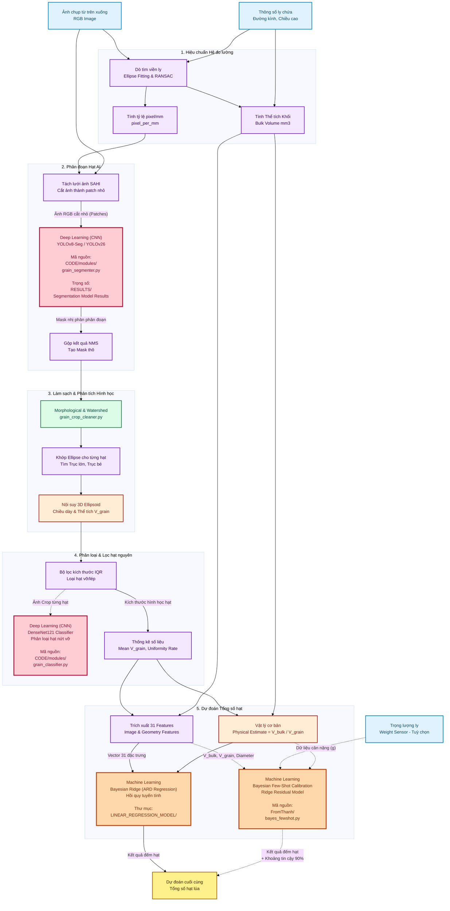

# Kiến trúc & Luồng hoạt động hệ thống đếm hạt gạo (RICAI Pipeline)

Dưới đây là sơ đồ luồng dữ liệu, trong đó làm nổi bật các **Mô hình Máy học (ML)** và **Học sâu (DL)** được sử dụng trong dự án, bao gồm đầu vào của chúng và thư mục chứa mã nguồn/trọng số.

### Các Mô Hình AI/ML Được Sử Dụng & Vị Trí:

1. **YOLO-Seg (YOLOv8 hoặc YOLOv26)**
   * **Phân loại:** Học sâu (Deep Learning - CNN)
   * **Nhiệm vụ:** Phân đoạn đối tượng hạt gạo (Instance Segmentation).
   * **Dữ liệu đầu vào:** Ảnh cắt nhỏ (Patches) sinh ra từ bộ cắt SAHI.
   * **Thư mục chứa mã nguồn:** `CODE/modules/grain_segmenter.py`
   * **Thư mục chứa kết quả/trọng số (Weights):** `RESULTS/Segmentation Model Results/`

2. **DenseNet121 Classifier (Tùy chọn)**
   * **Phân loại:** Học sâu (Deep Learning - CNN)
   * **Nhiệm vụ:** Phân loại nhị phân hạt nguyên / hạt nứt vỡ.
   * **Dữ liệu đầu vào:** Ảnh màu được cắt (crop) riêng lẻ từng hạt sau khi đã có mask phân đoạn.
   * **Thư mục chứa mã nguồn:** `CODE/modules/grain_classifier.py` và `CODE/TRAIN_CNN.ipynb`

3. **Bayesian Ridge / ARD Regression**
   * **Phân loại:** Máy học truyền thống (Machine Learning - Regression)
   * **Nhiệm vụ:** Dự đoán tổng số hạt gạo cuối cùng.
   * **Dữ liệu đầu vào:** Vector gồm 31 đặc trưng (Features) dạng bảng (Tabular) lấy từ kích thước vật lý của ly và các thông số đo lường hình học của hạt.
   * **Thư mục chứa mã nguồn:** `LINEAR_REGRESSION_MODEL/` (Dataset huấn luyện nằm ở `DATASET_BUILDER/`)

4. **Bayesian Few-Shot Calibration (Thuật toán của nhóm Thành)**
   * **Phân loại:** Máy học thống kê (Statistical Machine Learning)
   * **Nhiệm vụ:** Hiệu chuẩn (Calibrate) số lượng hạt dự đoán với khoảng tin cậy 90%, có khả năng tối ưu (fine-tune) theo từng loại ly mới chỉ bằng vài mẫu (Few-shot).
   * **Dữ liệu đầu vào:** Thể tích khối (V_bulk), Thể tích hạt (V_grain), Đặc trưng ly, và tuỳ chọn Cảm biến cân nặng (Weight Sensor).
   * **Thư mục chứa mã nguồn:** `FromThanh/bayes_fewshot.py` và notebook `Copy of rice_fewshot_v2_colab.ipynb`