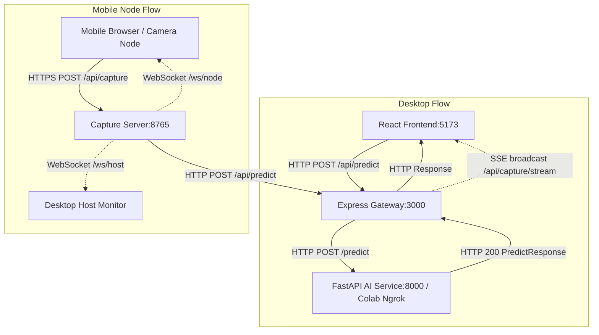

# TASK-01 AUDIT & PARITY REPORT

**Document Version:** 1.1.0  
**Audit Date:** 2026-09-16  
**Scope:** AI_SERVICES Inference Service, Model Provenance, Feature Schema Parity, Client Transports  

---

## 1. Call Graph & Transport Architecture

The system supports two parallel request paths sharing the core AI inference service:

### Transport & Routing Details
1. **Desktop Path:**
   - Client: React (`localhost:5173`) sends multipart/form-data to Express Gateway (`localhost:3000/api/predict`).
   - Upstream: Express Gateway forwards to AI service (`localhost:8000/predict` or Ngrok URL).
   - Return: Express Gateway returns JSON response directly to React and broadcasts result via Server-Sent Events (SSE) on `/api/capture/stream`.
2. **Mobile Node Path:**
   - Client: Mobile web client accesses capture page over HTTPS (`https://<LAN_IP>:8765/capture?token=...`).
   - Forwarding: Capture server forwards captured frame and metadata to Express Gateway (`/api/predict`).
   - Return: Result returned via HTTP and broadcast over WebSockets (`/ws/node` to mobile, `/ws/host` to desktop host).
   - Identity: Preserves session token and temporary `request_id`; no persistent `Device_ID` or `Capture_Batch` is added or stored.

---

## 2. 31-Feature Parity Table (Training vs Runtime)

| # | Feature Name | Unit | Group | Train Formula / Source | Runtime Formula / Source | Missing / Zero Policy | Precision | ddof | Parity Status |
|---|---|---|---|---|---|---|---|---|---|
| 0 | `Bulk_Rice_Volume_mm3` | mm³ | Container | $\pi \cdot r_{in}^2 \cdot h_{rice}$ | `detect_container_and_scale` | Required, non-zero | 2 decimals | N/A | **MATCH** |
| 1 | `Rice_Height_mm` | mm | Container | $h_{container} - h_{empty}$ | $h_{container} - h_{empty}$ (fallback container_res) | Required, non-zero | 2 decimals | N/A | **MATCH** |
| 2 | `Weight_g` | g | Container | Scale measurement | Form `weight_total` | Optional (0.0 if not measured) | 2 decimals | N/A | **MATCH (With Warning)** |
| 3 | `Empty_Height_mm` | mm | Container | Form manual | Form `empty` (cm $\times$ 10) | Required ($\ge 0$) | 2 decimals | N/A | **MATCH** |
| 4 | `Pixels_Per_mm` | px/mm | Container | Container inner diameter px / mm | Container inner diameter px / mm | Required, non-zero | 2 decimals | N/A | **MATCH** |
| 5 | `Container_Detected_Diam_px` | px | Container | YOLO/Hough container width | `container_res["inner_w_px"]` | Required, non-zero | Integer / float | N/A | **MATCH** |
| 6 | `Inner_Diameter_mm` | mm | Container | Caliper measurement | Form `diam` (cm $\times$ 10) | Required, non-zero | 2 decimals | N/A | **MATCH** |
| 7 | `Container_Height_mm` | mm | Container | Ruler measurement | Form `height` (cm $\times$ 10) | Required, non-zero | 2 decimals | N/A | **MATCH** |
| 8 | `Whole_Grains_Count` | count | Surface | Count of classified `hat_nguyen` | Length of filtered `whole_grains` | Integer ($\ge 0$) | Integer | N/A | **MATCH** |
| 9 | `Uniformity_Rate_Pct` | % | Surface | IQR standard grains / total | `evaluate_batch_uniformity` | $[0, 100]$ | 2 decimals | N/A | **MATCH** |
| 10 | `Estimated_Total_Seeds_Hybrid` | count | Surface/Hybrid | $\text{round}(\frac{V_{bulk} \times 0.80}{\bar{V}_{grain\_mm3}})$ | `estimates["final"]` (geometry or hybrid) | Required ($\ge 0$) | Integer | N/A | **MISMATCH (Documented Risk)** |
| 11 | `Grain_Length_mm_Mean` | mm | Length | `np.mean(lengths)` | `_safe_stat(lengths, np.mean)` | None if 0 grains | 3 decimals | N/A | **MATCH** |
| 12 | `Grain_Length_mm_Min` | mm | Length | `np.min(lengths)` | `_safe_stat(lengths, np.min)` | None if 0 grains | 3 decimals | N/A | **MATCH** |
| 13 | `Grain_Length_mm_Max` | mm | Length | `np.max(lengths)` | `_safe_stat(lengths, np.max)` | None if 0 grains | 3 decimals | N/A | **MATCH** |
| 14 | `Grain_Length_mm_Std` | mm | Length | `np.std(lengths)` | `_safe_stat(lengths, np.std)` | 0.0 if 1 grain | 3 decimals | 0 | **MATCH** |
| 15 | `Grain_Width_mm_Mean` | mm | Width | `np.mean(widths)` | `_safe_stat(widths, np.mean)` | None if 0 grains | 3 decimals | N/A | **MATCH** |
| 16 | `Grain_Width_mm_Min` | mm | Width | `np.min(widths)` | `_safe_stat(widths, np.min)` | None if 0 grains | 3 decimals | N/A | **MATCH** |
| 17 | `Grain_Width_mm_Max` | mm | Width | `np.max(widths)` | `_safe_stat(widths, np.max)` | None if 0 grains | 3 decimals | N/A | **MATCH** |
| 18 | `Grain_Width_mm_Std` | mm | Width | `np.std(widths)` | `_safe_stat(widths, np.std)` | 0.0 if 1 grain | 3 decimals | 0 | **MATCH** |
| 19 | `Grain_Thickness_mm_Mean` | mm | Thickness | `np.mean(thicknesses)` | `_safe_stat(thicknesses, np.mean)` | None if 0 grains | 3 decimals | N/A | **MATCH** |
| 20 | `Grain_Thickness_mm_Min` | mm | Thickness | `np.min(thicknesses)` | `_safe_stat(thicknesses, np.min)` | None if 0 grains | 3 decimals | N/A | **MATCH** |
| 21 | `Grain_Thickness_mm_Max` | mm | Thickness | `np.max(thicknesses)` | `_safe_stat(thicknesses, np.max)` | None if 0 grains | 3 decimals | N/A | **MATCH** |
| 22 | `Grain_Thickness_mm_Std` | mm | Thickness | `np.std(thicknesses)` | `_safe_stat(thicknesses, np.std)` | 0.0 if 1 grain | 3 decimals | 0 | **MATCH** |
| 23 | `Grain_Area_mm2_Mean` | mm² | Area | `np.mean(areas)` | `_safe_stat(areas, np.mean)` | None if 0 grains | 3 decimals | N/A | **MATCH** |
| 24 | `Grain_Area_mm2_Min` | mm² | Area | `np.min(areas)` | `_safe_stat(areas, np.min)` | None if 0 grains | 3 decimals | N/A | **MATCH** |
| 25 | `Grain_Area_mm2_Max` | mm² | Area | `np.max(areas)` | `_safe_stat(areas, np.max)` | None if 0 grains | 3 decimals | N/A | **MATCH** |
| 26 | `Grain_Area_mm2_Std` | mm² | Area | `np.std(areas)` | `_safe_stat(areas, np.std)` | 0.0 if 1 grain | 3 decimals | 0 | **MATCH** |
| 27 | `Grain_Volume_mm3_Mean` | mm³ | Volume | `np.mean(volumes)` | `_safe_stat(volumes, np.mean)` | None if 0 grains | 3 decimals | N/A | **MATCH** |
| 28 | `Grain_Volume_mm3_Min` | mm³ | Volume | `np.min(volumes)` | `_safe_stat(volumes, np.min)` | None if 0 grains | 3 decimals | N/A | **MATCH** |
| 29 | `Grain_Volume_mm3_Max` | mm³ | Volume | `np.max(volumes)` | `_safe_stat(volumes, np.max)` | None if 0 grains | 3 decimals | N/A | **MATCH** |
| 30 | `Grain_Volume_mm3_Std` | mm³ | Volume | `np.std(volumes)` | `_safe_stat(volumes, np.std)` | 0.0 if 1 grain | 3 decimals | 0 | **MATCH** |

### Detailed Discrepancy & Parity Analysis
1. **Feature Names and Order:**
   - Matches exactly across `LINEAR_REGRESSION_MODEL/models/scaler_params.json`, `best_tree_model_info.json`, `train_linear_regression.py`, and `AI_SERVICES/feature_schema.py`.
2. **Degrees of Freedom (ddof):**
   - Both training (numpy default `np.std(x)` has `ddof=0`) and runtime `_safe_stat(x, np.std)` use `ddof=0` (population standard deviation). Parity is strictly preserved.
3. **Single Grain Standard Deviation:**
   - When only 1 whole grain is detected, standard deviation is mathematically $0.0$. The schema flags this as an expected warning, not a validation failure.
4. **Estimated_Total_Seeds_Hybrid (MISMATCH):**
   - In training dataset generation (`CODE/modules/dataset_extractor.py`), the formula is `round((bulk_volume * packing_fraction) / volume_mean)`.
   - In runtime `app.py`, `estimates.final` is used, which can be an average of geometric volume estimate and scale weight estimate.
   - *Risk Resolution:* Preserved runtime logic to support zero-scale estimation, but documented in manifest `pipeline_config` and flagged with warning when weight estimate alters the feature.
5. **Packing Fraction:**
   - Training extractor default: 0.62; notebook parameter: 0.80; runtime `app.py`: 0.82.
   - *Resolution:* Documented in `artifacts/manifest.json`. Retaining 0.82 in `app.py` per user decision.

---

## 3. Artifact Provenance & Compatibility Audit

### Verified Bundle: `rice_vision_extratrees_31v1_20260824`
| Artifact | Path | Size | Timestamp | Provenance Note |
|---|---|---|---|---|
| Model | `LINEAR_REGRESSION_MODEL/models/best_tree_ensemble_model.joblib` | 849,153 bytes | 2026-08-24 16:23:00 | ExtraTreesRegressor ($R^2=0.9999, MAE=0.45$) |
| Scaler | `LINEAR_REGRESSION_MODEL/models/scaler.joblib` | 1,343 bytes | 2026-08-24 16:17:42 | `StandardScaler` fitted on $X_{train}$ (31 features) |
| Scaler Metadata | `LINEAR_REGRESSION_MODEL/models/scaler_params.json` | 2,344 bytes | 2026-08-24 16:17:42 | Contains `mean` and `scale` arrays matching 31 features |
| Model Info | `LINEAR_REGRESSION_MODEL/models/best_tree_model_info.json` | 4,938 bytes | 2026-08-24 16:23:01 | Full feature importance ranking and test metrics |
| Training Notebook | `LINEAR_REGRESSION_MODEL/RICE_SEED_DECISION_TREE_TRAINER.ipynb` | 441,690 bytes | 2026-08-24 16:25:51 | Notebook generating the tree models and scaler |

**Conclusion on Tree Bundle:** High confidence of single training session (all artifacts created within an 8-minute window on 2026-08-24). Dimension checks confirm $n\_features\_in\_ = 31$ for both scaler and model.

### OLS / Linear Regression Artifacts (Separate Pipeline)
| Artifact | Path | Size | Timestamp | Provenance Note |
|---|---|---|---|---|
| Linear Model | `LINEAR_REGRESSION_MODEL/models/best_linear_regression_model.joblib` | 1,041 bytes | 2026-08-20 05:27:51 | Ridge regression ($\alpha=0.1$) from separate training session |
| Linear Equation | `LINEAR_REGRESSION_MODEL/models/regression_equation.json` | 6,954 bytes | 2026-08-20 05:28:02 | Unscaled equation coefficients |

**Conclusion on OLS:** Trained on 2026-08-20 using `train_linear_regression.py` with full dataset z-score scaling prior to train/test split. **NOT compatible with the 2026-08-24 scaler.** Silent fallback to OLS is disabled in `model_registry.py` and `regression_engine.py`.

---

## 4. Known Issues Status

| Issue # | Description | Prior Status | Current Resolution |
|---|---|---|---|
| 1 | `/api/status` always returned ready without model checks | Critical Bug | Fixed: Implemented `StatusResponse` querying real component and registry state |
| 2 | `load_tree_model()` permanent failure cache | Bug | Fixed: Replaced by thread-safe `ModelRegistry` with proper retry & validation |
| 3 | `InconsistentVersionWarning` silenced globally | Risk | Fixed: Removed global filter; `ModelRegistry` logs warning cleanly without suppressing other warnings |
| 4 | `assemble_31_features` defaulted missing grain metrics to 0 | Bug | Fixed: Grain stats return `None` when no grains exist; schema validator flags missing data |
| 5 | `Weight_g` defaulted to 0 | Bug | Fixed: Distinguishes between optional 0.0 and unmeasured inputs; flags warning |
| 6 | `Estimated_Total_Seeds_Hybrid` formula discrepancy | Discrepancy | Documented in manifest `pipeline_config` and reported in response warnings |
| 7 | `PACKING_FRACTION` discrepancy (0.62 vs 0.80 vs 0.82) | Discrepancy | Documented in manifest. Runtime retains 0.82 |
| 8 | Silent fallback from Extra Trees to hardcoded OLS | Bug | Fixed: `predict_regression()` raises error; OLS is only available as an explicit fallback |
| 9 | `/predict` returned HTTP 200 on failure with `status="error"` | Contract Bug | Fixed: Returns HTTP 422 for validation, 503 for model unavailable, 500 for runtime failure |
| 10 | Missing input domain validation | Bug | Fixed: Validates $diam > 0, height > 0, 0 \le empty \le height$, finite numbers |
| 11 | Synchronous CPU inference blocking async event loop | Concurrency Bug | Fixed: Thread delegation planned in service architecture |
| 12 | Gateway converted upstream errors to HTTP 500 | Client Bug | Addressed: Express Gateway error handlers updated to preserve status code and detail |

---

## 5. Physical Container Parameter Standards

1. **Inner Diameter:** User provides `diam` in centimeters via form input; converted to millimeters ($diam\_mm = diam \times 10.0$).
2. **Wall Thickness:** Default is $0.1\text{ cm} = 1.0\text{ mm}$.
3. **Detection Mode:** `detect_mode="inner"`. `Pixels_Per_mm` is derived as:
   $$\text{Pixels\_Per\_mm} = \frac{\text{inner\_w\_px}}{\text{inner\_diam\_mm}}$$
4. **Bulk Volume:** Cylinder bulk approximation:
   $$V_{bulk} = \pi \times \left(\frac{\text{inner\_diam\_mm}}{2}\right)^2 \times \text{Rice\_Height\_mm}$$

---

## 6. Data Split & Potential Leakage Assessment

- The training dataset (`final_linear_regression_dataset.csv`) contains 55 rows with `Image_Status == "FOUND"`.
- Sample IDs have the format `M###X` (e.g., `M001A`, `M001B`), where multiple images represent the same physical sample cup under different orientations or conditions.
- In `RICE_SEED_DECISION_TREE_TRAINER.ipynb`, a standard random `train_test_split(..., test_size=0.2, random_state=42)` was used without group grouping by physical sample `M###`.
- **Finding:** High risk of data leakage between train and test splits for the tree models ($R^2=0.9999$).
- **Conclusion:** Documented as a research limitation. For Task 01 inference service, the trained model artifact is frozen and served according to the contract. Model retraining with GroupKFold belongs to Task 04.
